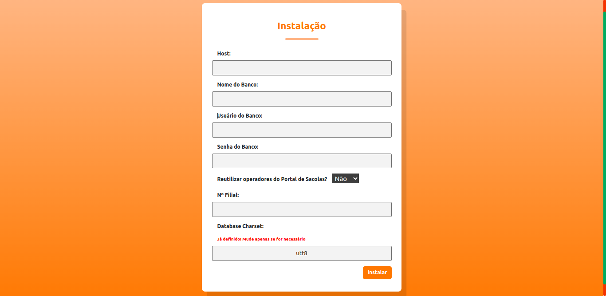

# Controle de Recargas

- [Sobre o Projeto](#sobre-o-projeto)
- [Executando em Produção](#executando-em-produção)
  - [Pré-requisitos](#pré-requisitos)
  - [Instalação](#instalação)
- [Executando Localmente (Desenvolvimento)](#executando-localmente-desenvolvimento)
- [Visão Geral da Tela de Dashboard](#visão-geral-da-tela-de-dashboard)
- [Legenda das Cores da Barra de Progresso](#legenda-das-cores-da-barra-de-progresso)
- [Gerenciando Arquivos CSV e Definindo a Meta](#gerenciando-arquivos-csv-e-definindo-a-meta)
- [Tela de Ranking dos Vendedores](#tela-de-ranking-dos-vendedores)
- [Tela de Operadores](#tela-de-operadores)
- [Tela de Usuários](#tela-de-usuários)
- [Relatório de Vendas](#relatório-de-vendas)
- [Tela de Instalação](#tela-de-instalação)
- [Credenciais de Acesso](#credenciais-de-acesso)
- [Suporte](#suporte)

## Sobre o Projeto

O **Controle de Recargas** é uma ferramenta dedicada a acompanhar as recargas de celulares pré-pagos em vista de uma meta mensal. Com ele, os usuários podem acessar informações detalhadas sobre:

- Venda acumulada
- Venda do dia
- Meta de venda para o dia
- Média de vendas
- Quantidade que falta para atingir a meta mensal
- Projeção de quando a meta será atingida

O projeto também oferece um CRUD para gerenciar operadores e um relatório que exibe um ranking de vendas dos colaboradores.

## Executando em Produção

### Pré-requisitos

- Servidor que suporte **PHP 7.4** para o backend.
- **npm**.
- Banco de dados **MariaDB 5.5**.

### Instalação

1. **No terminal a partir do projeto, acesse o diretório de configuração referente ao seu Sistema Operacional (Windows ou Linux)**:
   - Windows`:
   ```bash
   cd config/windows
   ```
   - Linux`:
   ```bash
   cd config/linux
   ```

### Windows
2. **Execute o script de instalação**:
   - no CMD, execute: `install.bat`:
   ```bash
   install.bat
     ```
2. **Configuração do host**:
   - `set_host.bat` Defina o host web para acessar o projeto recargas:
   ```bash
   NomeDoHost
     ```
   - https://NomeDoHost/recargas

3. **Construindo a aplicação**:
   - `build.bat` Caso o node_modules não esteja instalado no frontend, informe "s" para proseguir com a instalação: 
   ```bash
   Deseja instalar o node_modules? (s/n):
   - s
     ```

   - Ou instale acessando o diretório frontend
   ```bash
   cd frontend
   npm install
   ```
   - Aguarde o script executar o build da aplicação e mover os arquivos para a raiz do projeto.

4. **Configuração do banco de dados**:
   - `db_install.bat` Siga os passos para configurar os dados de conexão com o banco de dados
   ```bash
   - Host
   - Nome
   - Usuário
   - Senha
   - Número da filial
   - Reutilizar os usuários (dedicado à contexto específico)
   ```
5. **Montagem das tabelas no banco de dados**:
   - Acesse o link fornecido no final da instalação: `https://NomeDoHost/recargas/#/install` 
   - Siga os passos informados no navegador para montar as tabelas no banco de dados
     
## Executando Localmente (Desenvolvimento)

## Pré-requisitos

- Docker e Docker Compose
- Node.js (para o frontend)

Para iniciar os containers:

```
docker-compose up -d
```
Este comando iniciará os containers para o backend (PHP), banco de dados (MariaDB), frontend (Node.js) e phpMyAdmin.

Para encerrar os containers:

```
docker-compose down
```

Após iniciar os containers, você pode acessar:

- Frontend: http://localhost:3000
- Backend: http://localhost:8000
- phpMyAdmin: http://localhost:8080

## Visão Geral da Tela de Dashboard


A seção superior da tela de dashboard fornece uma visão geral das métricas de vendas:

- **Meta**: Define o objetivo de vendas para o mês.
- **Barra de Progresso**: Representa o progresso em direção à meta estabelecida. As cores da barra mudam conforme o progresso da meta, indicando o andamento do cumprimento da mesma.
- **Meta / Dia**: Meta de vendas definida para o dia atual.
- **Venda / Dia**: Total de vendas realizadas no dia atual.
- **Média / Mês**: Média de vendas diária ao longo do mês.
- **Falta**: Mostra a diferença entre a meta estabelecida e as vendas atuais.
- **Projeção**: Estima quando a meta de vendas será alcançada com base nas vendas atuais.

A seção inferior oferece detalhes sobre as transações:

- **Transações Aprovadas**: Total de recargas aprovadas.
- **Transações Canceladas**: Total de recargas que foram canceladas.
- **Transações Negadas**: Total de recargas que não foram aprovadas.

## Legenda das Cores da Barra de Progresso


Para ter acesso à legenda das cores da barra de progresso, clique na barra.
- A barra de progresso usa várias cores para indicar o andamento em relação à meta e os dias.

## Gerenciando Arquivos CSV e Definindo a Meta


A imagem mostra várias opções para gerenciar arquivos CSV e definir a meta:

- **Selecionar Arquivo CSV**: Um botão que permite escolher um arquivo `.csv` para ser importado.
- **Gerar CSV Demo**: Este botão azul, visível apenas em ambiente de desenvolvimento, permite gerar um arquivo CSV de demonstração.
- **Enviar**: Após selecionar o arquivo CSV, use este botão para submetê-lo para processamento.
- **Indicador da Última Submissão**: Mostra quando o último arquivo CSV foi submetido.
- **Definir Valor da Meta**: Um campo de entrada onde o usuário pode definir o valor da meta.
- **Gerar Relatório**: Um botão que permite gerar um relatório com base nos dados submetidos.

## Tela de Ranking dos Vendedores


A tela de Ranking exibe a ordem dos vendedores com base nas vendas realizadas. Quando um vendedor não está cadastrado, seu nome é destacado em vermelho.

## Tela de Operadores


A tela de Operadores é usada para adicionar e gerenciar vendedores. Aqui você pode:

- Adicionar novos vendedores inserindo nome e matrícula.
- Editar ou excluir vendedores existentes.
- Navegar entre páginas ou alterar a quantidade de vendedores exibidos por página.

- Obs: Disponível apenas se não estiver reutilizando o portal de sacolas.

## Tela de Usuários


A tela de Usuários é visível apenas para aqueles com perfil de Administrador. Ela permite:

- Adicionar novos usuários.
- Editar informações de usuários existentes.
- Excluir usuários.

## Relatório de Vendas


O relatório fornece um resumo das vendas e um ranking dos vendedores.

## Tela de Instalação

- Acessível em "https://host/recargas/#/install" (adapte ao seu caso).



Esta é a tela de instalação e configuração. Nela, você deve fornecer detalhes para a conexão com o banco de dados:

- Host
- Nome do banco
- Usuário do banco
- Senha do banco
- Se deseja ou não reutilizar o Portal de Sacolas
- Número da filial
- Charset (opcional)

Após a instalação, será solicitado que você vá para a tela de login. A tela de instalação não ficará mais disponível por motivos de segurança.

## Credenciais de Acesso

### Rota de Instalação no Frontend

**Desenvolvimento**:
- **Host**: db
- **Nome do banco**: recargas_db
- **Usuário do banco**: user
- **Senha do banco**: password
- **Reutilizar Portal de Sacolas**: Não
- **Número da filial**: 999

### Primeiro Acesso no Frontend
- **Matrícula**: admin
- **Senha**: admin

> **Nota**: Por razões de segurança, é altamente recomendado alterar o usuário e senha padrões após o primeiro acesso.

### Senha phpMyAdmin
- **Usuário**: user
- **Senha**: password


## Suporte

Em caso de dúvidas ou problemas, entre em contato com o desenvolvedor.
